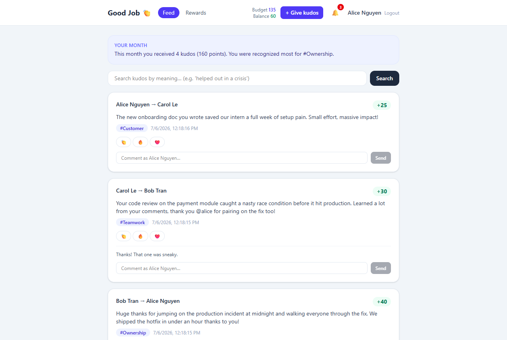

# Good Job 👏 — Employee Kudos & Rewards Platform

A full-stack recognition platform where teammates give each other kudos with points,
react/comment on a realtime feed, and redeem earned points for rewards — built as a
case study with a strong focus on **data integrity under concurrency**.



## Quick Start (one command)

```bash
cp .env.example .env        # defaults work out of the box
docker compose up -d --build
npm install
npm run db:seed -w @goodjob/api   # demo users + rewards (idempotent)
```

Open **http://localhost:8080** and sign in with a demo account (no password — see
[Trade-offs](#trade-offs--what-id-do-next)):

| Account | Role |
|---|---|
| `alice@goodjob.dev` | member + admin (manages rewards) |
| `bob@goodjob.dev`, `carol@goodjob.dev` | members |

API runs at http://localhost:3000. For local development instead of containers:

```bash
docker compose up -d db redis
npm run db:migrate -w @goodjob/api && npm run db:seed -w @goodjob/api
npm run start:dev -w @goodjob/api     # API on :3000
npm run dev -w @goodjob/web           # Web on :5173
```

## Architecture

```
┌─────────────┐  HTTP + WebSocket   ┌──────────────────────────┐
│  React SPA  │ ◄─────────────────► │        NestJS API        │
│ Vite + RQ + │                     │  (BullMQ worker runs     │
│   Zustand   │                     │       in-process)        │
└─────────────┘                     └───────┬──────────┬───────┘
                                            │          │
                                   ┌────────▼───┐  ┌───▼────────────┐
                                   │ PostgreSQL │  │     Redis      │
                                   │ + pgvector │  │ pub/sub · lock │
                                   │  (ledger)  │  │ · BullMQ queue │
                                   └────────────┘  └────────────────┘
```

**Why PostgreSQL?** Points are money-like: budgets and balances need ACID
transactions and row-level locking. pgvector adds AI semantic search in the same
database — no extra vector store to operate.

**Why the Ledger pattern?** `PointLedger` is append-only; balance = `SUM(delta)`.
A mutable counter silently corrupts under concurrent writes and loses history.
The ledger gives an immutable audit trail — even deleting a kudo *appends* a
reversal entry (`KUDO_REVOKED`) instead of erasing the past.

**Why two separate balances?** *Giving budget* (200/month, resets by having one
`GivingBudget` row per `(user, yearMonth)` — a new month simply starts a fresh
row) is deliberately separate from the *redeemable balance* (earned via ledger).
You can't give away what you earned, and vice versa.

**Why Redis?** Three jobs, one dependency: pub/sub fan-out for realtime
notifications (works across multiple API instances — the socket may live on
another instance than the one handling the request), NX locks for redemption
idempotency, and the BullMQ backing store.

**Why BullMQ?** Video validation must not block the HTTP request path. Uploads
return immediately (`status=processing`); a worker probes duration with ffprobe
and broadcasts the result over WebSocket.

**Why React Query + Zustand?** Server state (feed, budget, balance) belongs in a
cache with invalidation — React Query gives `useInfiniteQuery` for the feed and
optimistic updates for giving kudos. Zustand handles the little true client
state (session, modal, toasts) with almost no boilerplate. Redux would be both
heavier and worse-fitting.

## Concurrency & Data Integrity

The two money-like flows are defended in layers — all verified by automated
concurrency tests (see [Testing](#testing)).

**Give kudos (never exceed the 200-point monthly budget)**

1. `SELECT … FOR UPDATE` on the sender's `GivingBudget` row inside the
   transaction — concurrent gives queue up on the row lock, then re-check the
   remaining budget. (Never `SELECT SUM(...) FOR UPDATE` — Postgres forbids
   `FOR UPDATE` with aggregates.)
2. Budget charge, kudo insert, and receiver ledger credit commit atomically.

**Redeem a reward (no double-spend)** — four layers:

1. **Frontend**: redeem button disables while in flight and sends a fresh
   `Idempotency-Key` (UUID) per attempt.
2. **Redis NX lock** (`redeem:{userId}:{key}`, 10s TTL): rapid duplicate clicks
   are rejected before touching the database.
3. **Unique `idempotencyKey`** on `Redemption`: a retry of an already-successful
   redemption returns the *original* redemption (checked first inside the
   transaction, with a `P2002` catch as the safety net for the race) — the
   client can retry safely and is never charged twice.
4. **User row lock** (`SELECT … FOR UPDATE`) serializes all redemptions per
   user, making the ledger `SUM` balance check race-free.

Trade-off noted: the user row lock serializes *all* redemptions of one user —
correct and simple at this scale; at higher scale I'd move to a balance
snapshot table with its own row lock (or optimistic locking with a version
column) to avoid re-summing the ledger.

## Realtime & Media

- **Notifications**: kudo received, `@mention` in descriptions/comments, and
  comment events are written in the same transaction as the business change,
  then published to `notifications:{userId}` on Redis *after commit* — sockets
  can never observe uncommitted data. A socket.io gateway (JWT handshake)
  subscribes and delivers to the user's room; the web app toasts and updates
  the bell live.
- **Video uploads** (≤ 3 min): multer `diskStorage` streams straight to disk —
  the file is never buffered in memory (OOM-safe), with `limits.fileSize`
  rejecting oversized uploads early. A BullMQ worker validates duration via
  ffprobe (reads only metadata) and flips `status` to `ready`/`failed`; feed
  clients get a `media-update` broadcast and refresh.

## AI Features (Gemini + pgvector)

- **Semantic search** (`GET /kudos/search?q=`): kudo descriptions are embedded
  with `text-embedding-004` (768 dims) into a pgvector column; queries rank by
  cosine distance (`<=>`, ivfflat index). Added through a hand-edited Prisma
  migration (`--create-only`) so `CREATE EXTENSION vector` and the index live
  in migration history — reproducible in CI, no schema drift.
- **Monthly summary** (`GET /users/me/monthly-summary`): one LLM call
  summarizing the month's recognition, shown as a card above the feed.
- **Degrades gracefully**: without `GEMINI_API_KEY`, search falls back to
  keyword `ILIKE` matching and the summary falls back to computed stats. AI
  never takes the core product down.

## Testing

```bash
npm test -w @goodjob/api            # unit
npm run test:e2e -w @goodjob/api    # integration + concurrency (needs db+redis)
npm run test:e2e:cov -w @goodjob/api
```

Edge cases covered (23 tests):

- give-kudo API → kudo + budget + ledger persisted consistently
- self-give rejected; points outside 10–50 rejected (DTO validation)
- **monthly budget reset**: last month exhausted at 200 → this month still works
- **6 concurrent 40-point gives → exactly 3 succeed, spent stays ≤ 200**
- redeem above balance rejected; missing `Idempotency-Key` rejected
- **5 concurrent redeems with the same key → exactly 1 redemption row**
- idempotent retry returns the original redemption, no double charge
  *(this test caught a real ordering bug: the balance check ran before the
  idempotency check, turning valid retries into 400s — fixed)*
- concurrent redeems with different keys are limited by balance; ledger SUM
  never goes negative
- deleting a kudo refunds the budget and appends a reversal ledger entry
  (original entry kept — append-only audit); only the sender may delete

CI (GitHub Actions) runs migrate → unit → e2e (against pgvector + Redis
service containers) → builds on every push/PR.

## Project Structure

```
apps/api   NestJS + Prisma 6 (modules: auth, users, kudos, rewards,
           notifications, media, ai; common guards/filters/utils)
apps/web   React 19 + Vite + Tailwind v4 + React Query + Zustand
docs/      screenshots
```

## Trade-offs & What I'd Do Next

Being honest about scope cuts:

- **Auth is mock login by email** (JWT, no password) — the case study grades
  flows, not identity. Production path: OIDC/SSO (the guard layer is already
  in place, only the login handler changes). Admin role is an env allowlist
  (`ADMIN_EMAILS`) instead of a roles table for the same reason.
- **Uploads live on local disk** (compose volume). Next: stream to S3-compatible
  storage; the queue/worker pipeline stays identical.
- **The BullMQ worker runs in-process** with the API. Next: run the same image
  as a separate `worker` service for independent scaling.
- **Search re-embeds the query on every request** — fine at this size; add a
  short-TTL cache next.
- Live deploy (Railway/Vercel) not included — `docker compose up` reproduces
  the full system locally in one command.
